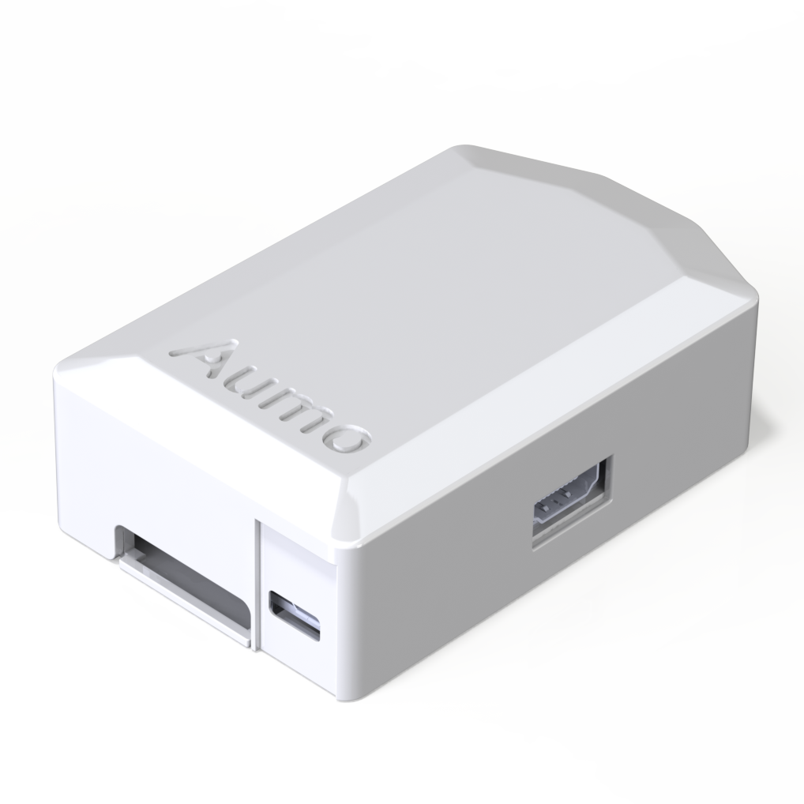

# Увод

За изработката на касови бележки се използват множество ресурси. Някои, от които включват:

- BPA (Bisphenol A / Бисфенол А)
- Дърво

Първите, от които са токсични за човешката кожа, Бисфенол А, може да доведе до заболявания като рак, захарен диабет тип 2, наднормено тегло и други.
Тонове дървета биват отсичани за създаването на хартията на касовите бележки. Статистики показват, че се отисчат 60 000+ декара гори годишно само от "Големите 5 държави".
Премахването на тези ресурси ще се подпомогне, както и на хората живущи на нашата планета, така и на самата планета.

С тази разработка целим заменянето на хартиените касови бележки с дигитална алтернатива. За да постигнем тази цел трябва да бъдат решени следните задачи:

- Планиране на архитектура и подбор на правилните технологии
- Създаване на устройство, което ще играе ролята на посредник между касови апарти и мобилното приложение
- Разработка на backend сървър
- Оформяне на красив и лесен за използване графичен интерфейс
- Мобилно приложение за клиентите на заведения или магазини
- Мотив за потребителите (система за награди и точки - Gamification)
- Административен панел за добавяне на награди
- Рекламиране

# Галерия

{ width=50% }
{ width=50% }

# Функции

Приложението ни предоставя следните функции:

- Светкавична бързина
- Изпращане на информация (дигитална касова бележка) чрез NFC (Near-Field Communication)
- Виртуален магазин за промоции/награди предоставени от търговсия обект
- Потребителски панел (Мобилно приложение)
- Административен панел за управление на виртуалния магазин
- История от всички касови бележки
- Създаване на списък с разходите извършени за деня/седмицата/месеца съответно

# Как работи

Между всеки касов апарат и компютъра, свързан с него, ще бъде поставено по едно устройство - **Aumo**.
**Aumo** представлява малък компютър (в случая Raspberry Pi), поставен в кутийка (изработена в случая от 3D принтер).
Устройството ще играе роля на посредник и ще приема нужната информация от компютъра и в зависимост от избора на клиента,
касовия бон ще бъде изпратен към принтера или към NFC модул (в случаите, когато клиента няма телефон, той може по да изисква своя касов бон по традиционния начин).
Към този компютър - **Aumo** е свързан с NFC модул, чрез който той получава информация за касовия бон от компютъра (POS системата), а мобилното приложение ще получава касовата бележка чрез допир до устройството по NFC.
Потребителите ще могат да допрат тяхното мобилно устройство до **Aumo**, изполвайки мобилното ни приложение и касовия бон ще бъде добавен в техния профил.

# Мотив (Геймификация)

При всяко използване на **Aumo** клиента получава точки, те могат да бъдат обменени за бонуси, промоции или предметни награди предоставени от търговския обект, като по този начин клиентите биват мотивирани да използват нашето приложение.

Досега всичко е било "на хартия". Този подход с дигитализация на нещо толкова битово ще изисква много усилия, тъй като ние хората обичаме да стоим в комфортната си зона и често не обичаме промяна. Затова ние решихме да вкараме геймификация в **Aumo**, като по този начин клиентите ще бъдат мотивирани да използват дигитална касова бележка пред традиционната - хартиена, както и да посещават по често съответния търговски обект предлагащ услугата. Така усилията, които трябва да бъдат положени, както от страна на клиенти, така и от страна на собствениците на търговските обекти няма да се усещат и ще бъдат забавни.

# Технологии

## Backend

### go

Като език за програмиране използвахме **go**, тъй като е бърз, гъвкав, лесен за писане и разбиране и може да се компилира към всички операционни системи - macOS, Linux, Windows.

### go-chi

Като библиотека за HTTP сървър ползвахме **go-chi**, поради факта че е тънък слой (wrapper) над стандартната библиотека на **go** - **net/http**. Предоставя лесна абстракция за създаване на REST API. Малък пример за сървър:

```go
package main

import (
	"net/http"
	"github.com/go-chi/chi"
)

func main() {
	r := chi.NewRouter()
	r.Get("/", func(w http.ResponseWriter, r *http.Request) {
		w.Write([]byte("welcome"))
	})
	http.ListenAndServe(":3000", r)
}
```

### MariaDB (MySQL)

Използвахме **MySQL** (или по-конкретно **MariaDB**) като база от данни, поради широкото ѝ разпространение в индустрията. Лесна е за използване и конфигуриране.

### GORM

Като библиотека за свързване и абстракция от **go** към **MySQL**, се спряхме на **GORM**. Много бързо и лесно успяхме да създадем нашите модели. Само с няколко реда код, ние можем да имаме потребители в нашата база от данни.

\newpage

```go
type User struct {
	gorm.Model
	Name     string     `json:"name" gorm:"not null"`
	Email    string     `json:"email" gorm:"unique;not null"`
	Password string     `json:"-" gorm:"not null" gob:"-"`
	Avatar   string     `json:"avatar" `
	Points   float64    `json:"points" gorm:"not null"`
	Orders   []ShopItem `json:"orders" gorm:"many2many:user_shop_item;"`
	Receipts []Receipt  `json:"receipts"`
}

func (a *Aumo) CreateUser(u User) (User, error) {
	if err := a.db.Create(u).Error; err != nil {
		return nil, err
	}

	return u, nil
}
```

### Redis

За сесии, кеширане за MySQL заявки използвахме **Redis** заедно с **go-redis**.

### Raspberry Pi

За устройството използахме **Raspberry Pi**, поставено в 3D принтиранa кутиика, направена в CAD системата **Solidworks**. Кутията беше принтирана в Русенския Университет, тъй като те разполагат с 3D принтер.

{ height=8.5cm }

### Docker

За deployment (публикуване) на нашото приложение, използвахме технологията за контейнери, по-конкретно - **Docker**. Той ни предоставя еднакъв environment, независимо от операционната система, дистробуция или други. Също така ни улеснява живота относно scaling (скалиране) на много иснтанции.

## Frontend

### React и React-Native

За да създадем хубав и гъвкав интерфейс, заедно с reusable компоненти използвахме **React** - библиотека създадена от Facebook. За мобилното приложение използвахме по-конкретно **React-Native**, тъй като можем да пишем един код за всички платформи - iOS и Android.

# Етапи на развитие

## Избор на тема

Заедно със Симо бяхме в Стара Загора (участвахме на състезание), седнахме да хапнем
по 1 бургер, за да се заредим с енергия. Аз вече си бях поръчал моя и седнах да пазя място, дойде ред на Симо на опашката да си закупи своя бургер, но на него му направиви впечетление нещо. Зад касите стояха кофи за боклук преливащи от касови бележки, които така и не влизат в употреба а само се изхвърля на вятъра природен ресурс. Така той дойде при мен и предложи да измислим нещо, с което можем да спрем този проблем възмно най-скоро - роди се идеята за **Aumo**.

## Проучване

При установено проучване от нас - Любо и Симо, не успяхме да открием подобни решения, действащи в момента на пазара. Така се убедихме, че е време да започнем работа върху бъдещият ни продукт - **Aumo**.

## Избиране на технологии и архитектура
През този етап ни минаха доста идеи относно подхода ни с технологиите, като се спряхме на вече гореспоментати. (Виж сек. [Технологии]).

## Изработване

Започнахме работа върху проекта, по време на Русенския хакатон (TeenHack Ruse 2019) провел се в началото на октомври.
- Тогава успяхме да създадем REST API написан на **go** чрез, който извършаме CRUD операции.
- Изградихме базова концепция за нашия графичен интерфейс - **Figma**
- Създадохме нашето мобилно приложение с **React Native**
- Свързахме мобилното приложение със сървъра ни

# Заключение

**Aumo - дигиталните касови бележки на бъдещeто** ще спаси тонове хартия, като съответно ще бъдат запазени хиляди декари гори и спасяването на потенциално изчезващи живонски видове (тези, които живеят по дърветата). Предполага се, че търговските обекти ще започнат да печелят повече благодарение на геймификацията влючена в **Aumo**.
Хората ще спрат да губят своите касови бележки и ще могат лесно и бързо да си правят отчет за деня или седмицата къде какви пари отиват.
Намалява се рискът за различни заболявания, като например рак, и диабет, тъй като BPA вече не е фактор в този вид бележки.

Въпреки предизвикателността на поставените от нас задачи, ние успяхме да преодолеем почти всички. Подбрахме правилната за нуждите ни технология, която да може бързо да се справя с поставените от нас задачи.

Приложението е все още в процес на разработка, като към момента съществува само базов прототип, но се очаква до края на декември 2019 год. то да бъде почти завършено.

# Бъдеще и развитие

Lorem ipsum dolor sit amet, consetetur sadipscing elitr, sed diam nonumy eirmod tempor invidunt ut labore et dolore magna aliquyam erat, sed diam voluptua. At vero eos et accusam et justo duo dolores et ea rebum. Stet clita kasd gubergren, no sea takimata sanctus est Lorem ipsum dolor sit amet.
