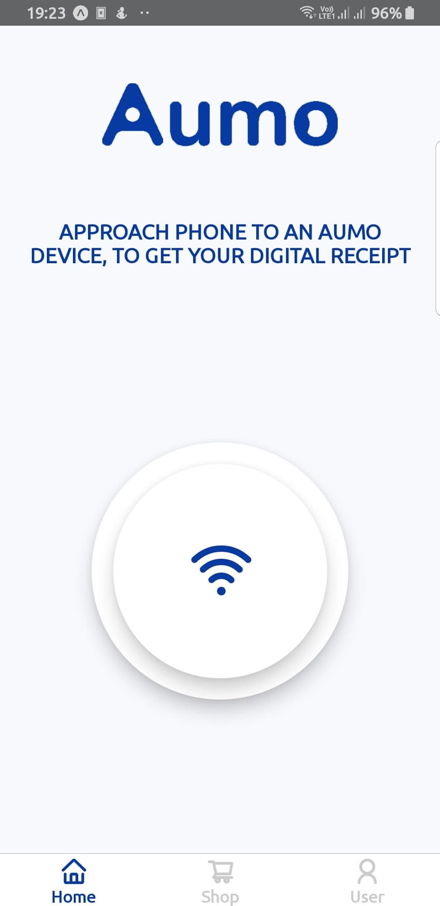
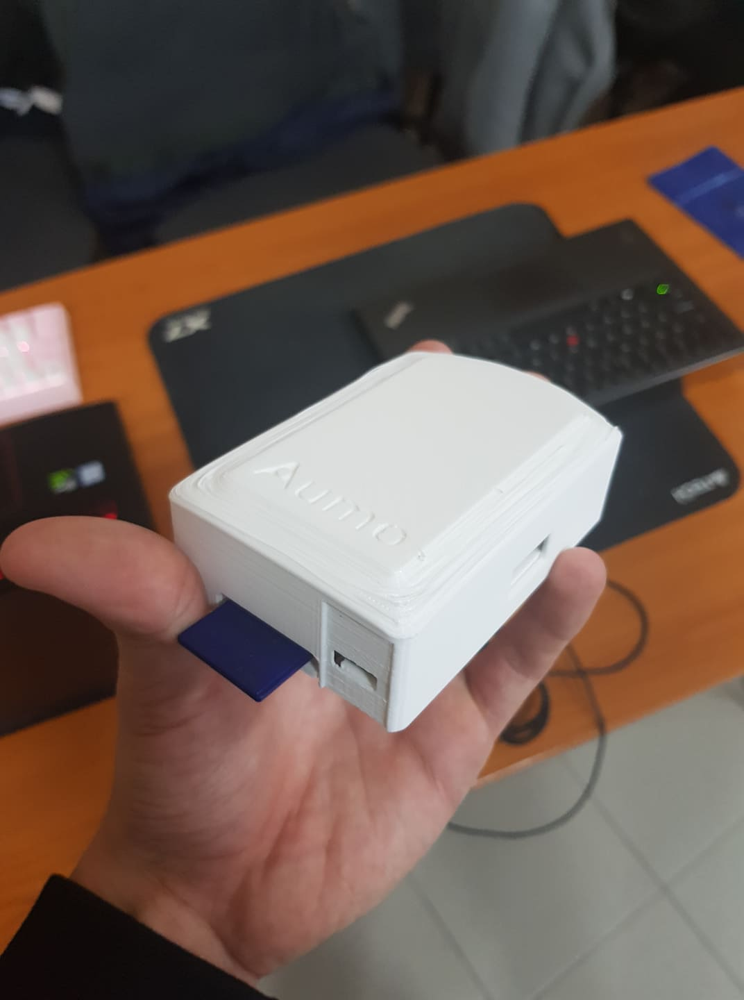

# Увод

За изработката на касови бележки се използват множество ресурси. Някой от които включват:

- BPA (Bisphenol A / Бисфенол А)
- Дърво

Първите от които са токсични за човешката кожа, Бисфенол А, може да доведе до заболявания като рак, захарен диабет тип 2, наднормено тегло и други.
Тонове дървета биват отсичани за създаването на хартията на касовите бележки. Статистики показват че се отисчат 60 000+ декара гори годишно само от "Големите 5 държави".
Премахването на тези ресурси ще се подпомогне така и на хората живущи на нашата планета, така и на самата планета.

С тази разработка целим заменянето на хартиените касови бележки с дигитална алтернатива. За да постигнем тази цел трябва да бъдат решени следните задачи:

- Планиране на архитектура и подбор на правилните технологии
- Създаване на устройство, което ще играе ролята на посредник между касови апарти и мобилното приложение
- Разработка на backend съврър
- Оформяне на красив и лесен за използване графичен интерфейс
- Мобилно приложение за клиентите на заведения или магазини
- Мотив за потребителите (система за награди и точки - Gamification)
- Административен панел за добавяне на награди

# Галерия

{ width=50% }
{ width=50% }

# Функции

Приложението ни предоставя следните функции:

- Светкавично бързо
- Изпращане на информация (дигитална касова бележка) чрез NFC (Near-Field Communication)
- Виртуален магазин за промоции/награди предоставени от търговсия обект
- Потребителски панел (Мобилно приложение)
- Административен панел за управление на виртуалния магазин
- История от всички касови бележки
- Създаване на списък с разходите извършени за деня/седмицата/месеца съответно

# Как работи

Между всеки касов апарат и компютъра, свързан с него, ще бъде поставено по едно устройство - **Aumo**.
**Aumo** представлява малък компютър (например Raspberry Pi), поставен в кутийка (изработена например от 3D принтер).
Устройството ще играе роля на посредник и ще приема нужната информация от компютъра и в зависимост от избора на клиента,
касовия бон ще бъде изпратен към принтера или към NFC модул.
Към този компютър е също свързан NFC модул, чрез който мобилно приложение ще получава касовата бележка.

# Мотив (Геймификация)

Lorem ipsum dolor sit amet, consetetur sadipscing elitr, sed diam nonumy eirmod tempor invidunt ut labore et dolore magna aliquyam erat, sed diam voluptua. At vero eos et accusam et justo duo dolores et ea rebum. Stet clita kasd gubergren, no sea takimata sanctus est Lorem ipsum dolor sit amet.

# Технологии

Lorem ipsum dolor sit amet, consetetur sadipscing elitr, sed diam nonumy eirmod tempor invidunt ut labore et dolore magna aliquyam erat, sed diam voluptua. At vero eos et accusam et justo duo dolores et ea rebum. Stet clita kasd gubergren, no sea takimata sanctus est Lorem ipsum dolor sit amet.

# Етапи на развитие

Lorem ipsum dolor sit amet, consetetur sadipscing elitr, sed diam nonumy eirmod tempor invidunt ut labore et dolore magna aliquyam erat, sed diam voluptua. At vero eos et accusam et justo duo dolores et ea rebum. Stet clita kasd gubergren, no sea takimata sanctus est Lorem ipsum dolor sit amet.

# Заключение

Lorem ipsum dolor sit amet, consetetur sadipscing elitr, sed diam nonumy eirmod tempor invidunt ut labore et dolore magna aliquyam erat, sed diam voluptua. At vero eos et accusam et justo duo dolores et ea rebum. Stet clita kasd gubergren, no sea takimata sanctus est Lorem ipsum dolor sit amet.

# Бъдеще и развитие

Lorem ipsum dolor sit amet, consetetur sadipscing elitr, sed diam nonumy eirmod tempor invidunt ut labore et dolore magna aliquyam erat, sed diam voluptua. At vero eos et accusam et justo duo dolores et ea rebum. Stet clita kasd gubergren, no sea takimata sanctus est Lorem ipsum dolor sit amet.
