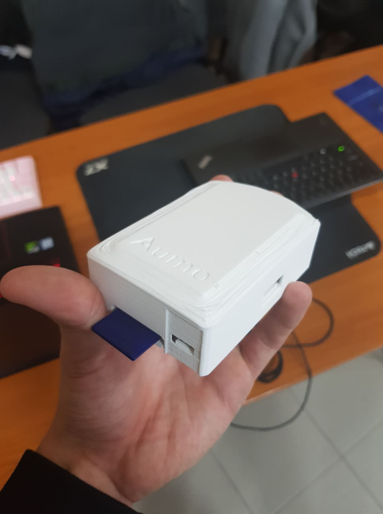
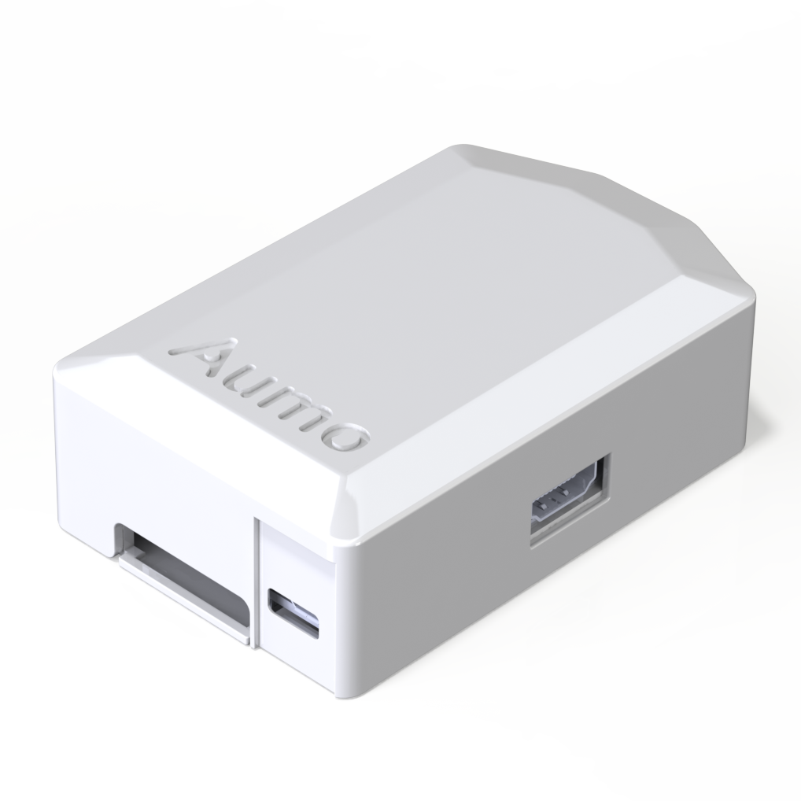

# Luncher Box

Тонове касови бележки биват създадени и веднага изхвърелни, като за изработката им се използва химикал вреден за човека, заедно с дървесна маса, което означава, че хиляди декари гори биват отсичани годишно и мнозина се разболяват.

**Aumo** е разработка, която цели да замести хартиените касови бележки с дигитални. Това ще бъде постигнато благодарение на мобилно приложение, придружено с хардуерно устройство.

## Категория

Хардуер

## Възрастова група

Над 16 години.

## Описание

**Aumo** е мобилно приложение, придружено с хардуерно устройство и уеб съврър, което цели да премахне хартиените касови бележки, като ги замести с дигитални. Касовите апарати на магазини и заведения ще бъдат оборудвани с **Aumo**. Клиентите ще получат техните дигитални касови бележки при допира на тяхното мобилно устройство (през мобилното ни приложение) с **Aumo** чрез NFC (Near-Field Communication) технология.
За мотив да се използва дигиталната касова бележека пред хартиения еквавилент, потребителите ще бъдат възнаграждавани с точки, всеки път когато клиентът предпочете **Aumo** пред традиционната касова бележка. Тези точки могат да бъдат използвани за бонуси под формата на намаления или материални награди, осигурени от търговския обект.

В процеса на създаване на приложението се пробвахме да открием подобни решения, но такива така и не открихме.

Към текуща дата (31 януари 2020), **Aumo** е завършен на $75$%.

# Screenshots

## Екип

- **Симо Александров** - дал главната идея, работил върху client (admin панел и mobile app) и server
  - SoftUni username: **simo3003**, Tel. **[REDACTED]**, E-mail: [simo@deliriumproducts.me](mailto:simo@deliriumproducts.me)
- **Любо Любчев** - работил върху client (admin панел и mobile app) и server
  - SoftUni username: **IMPZERO**, Tel. **[REDACTED]**, E-mail: [lyubo@deliriumproducts.me](mailto:lyubo@deliriumproducts.me)

## Демо

Предоставяме демо на admin панел:

  - [aumo.deliriumproducts.me](https://aumo.deliriumproducts.me)

Данни за достъп:
  
  - email: **[REDACTED]**
  - password: **[REDACTED]**

## Технологии

|    Client    | Server |     Miscellaneous     |
| :----------: | :----: | :-------------------: |
|    babel     |   go   |        Testing        |
| react-native | go-chi |          NFC          |
|   next.js    |        |        Caching        |
|   react.js   |        |    MySQL / MariaDB    |
|     JSX      |        |         Redis         |
|  CSS-in-JS   |        |         HTTP          |
|   Webpack    |        |         REST          |
|     PWA      |        |     Raspberry Pi      |
|     SPA      |        |       Sessions        |
|  UI Kitten   |        |        Cookies        |
|  Ant design  |        |        Docker         |
|              |        | Git / Version Control |
|              |        | Continous Integration |
|              |        |  Domain Name System   |
|              |        | Linux / Shell scripts |
|              |        |         Nginx         |
|              |        |          SSH          |
|              |        |   TLS / SSL / HTTPS   |

## Сорс код

[DeliriumProducts/aumo](https://github.com/deliriumproducts/aumo)